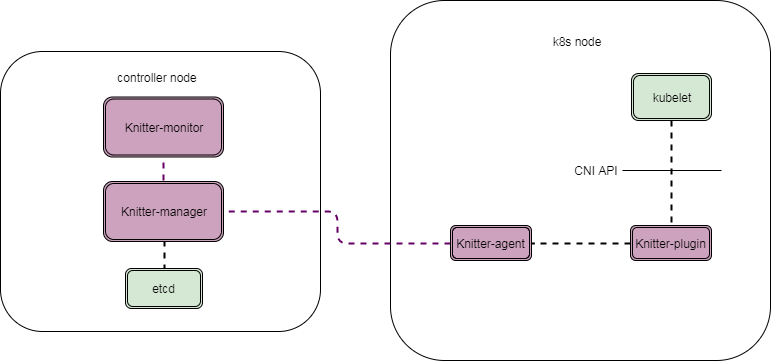
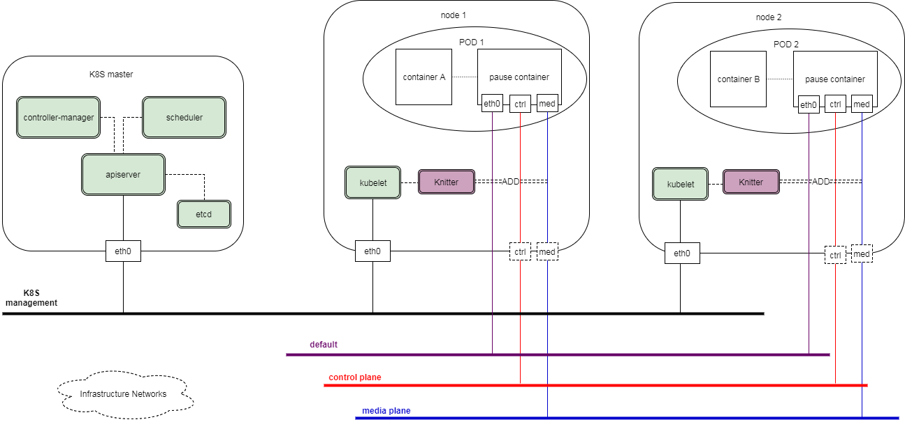

# Knitter

## Overview
- is a [CNI](https://github.com/containernetworking/cni) plugin to support multiple network interfaces in a [Kubernetes](https://github.com/kubernetes/kubernetes) pod.
- provides the ability for a pod (e.g., VNF in pod) to attach to high-performance networks. 
- allows users specifying customized networks according to their infrastructure.
- can run on public clouds, private clouds and hybrid clouds.
- supports both VM and bare-metal cloud environments.

## Architecture

Knitter includes three components:
- **Knitter-manager**: it runs on a central controller node (which can be K8S master or a separate host). It interactives with network infrastructure and manages the network(s) that used by the cluster. `Knitter-manager` serves as an API server.
- **Knitter-plugin**: it's a CNI plugin whick is invoked by kubelet with CNI API. It forwards the network setting up request from kubelet to `Knitter-agent` and sends the result back.
- **Knitter-agent**: it runs on each node of the K8S cluster. It processes the forwarded request fromm `Knitter-plugin`. It queries networks configured in annotations of pod spec from kube-apiserver. Then it requests `Knitter-manager` to allocate all the needed resources. Once all things are ready, it sets up the network stack for the pod. Once it finishes, it sends the result back to `Knitter-plugin`.

One of the topology of K8S management network and pod networks is as below. It can vary depending on the mode of Knitter.

## Mode
TBA

## Build
TBA

## Usage
TBA

## Contributing to Knitter
TBA

## Contact
TBA
